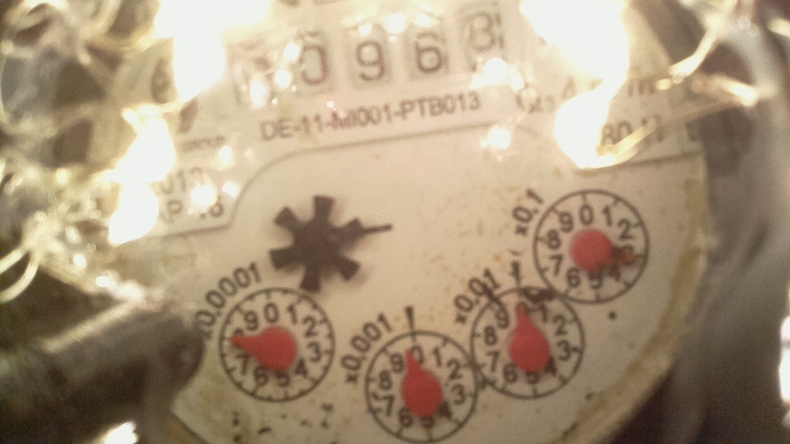
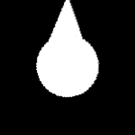

# Water Meter

Water meter is an application for Raspberry Pi that can be used with an analog water meter with
needles to read the values that the needles represent. The interpreted value is stored to InfluxDB 
database.

### Requirements

Raspberry Pi with camera and Python 3 with numpy, OpenCV and influxdb libraries.

### Idea of operation

Raspberry Pi camera is used to take a picture of the water meter. The water meter has 4 dials
representing the decilitres of water usage.

Each needle is in a fixed location since the Raspberry Pi camera is mounted on a 3D printed mount
on top of the water meter. A black and white mask of each dial is generated using OpenCV library
and HSV color space. A mask image is rotated on top of each dial with logical XOR operation. 

The dial angle is the angle where the XOR of the mask image and generated black and white dial image
has the leash white color. The angles of the dials are then interpreted and the result is stored
to InfluxDB database.